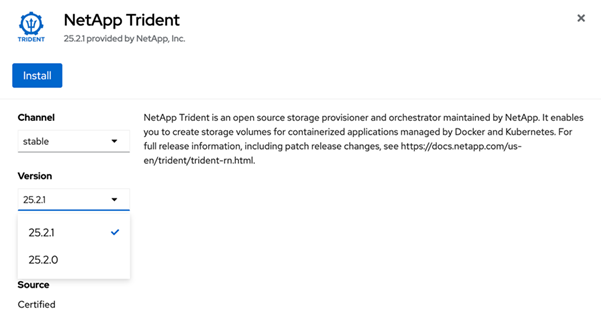

= Installez Trident en utilisant OpenShift OperatorHub
:hardbreaks:
:allow-uri-read: 
:icons: font
:imagesdir: ../media/

[role="lead"]
Si vous utilisez Red Hat OpenShift, vous pouvez installer NetApp Trident à l'aide de l'opérateur certifié Red Hat. Utilisez cette procédure pour installer Trident depuis la plateforme Red Hat OpenShift Container.

.Avant de commencer
Avant de commencer l'installation, link:../trident-get-started/requirements.html["Préparez votre environnement pour l'installation de Trident"].

== Trouvez et installez l’opérateur Trident

.Étapes
. Accédez à OpenShift OperatorHub et recherchez NetApp Trident.
+
image::../media/openshift-operator-01.png[Opérateur Trident]

. Cliquez sur *NetApp Trident* pour ouvrir les paramètres d'installation.
. Sélectionnez les options requises et cliquez sur *Installer* pour ouvrir la configuration de l’opérateur.
+

+

NOTE: Assurez-vous de sélectionner la version la plus récente d'Operator.

. Conservez tous les paramètres tels quels et cliquez sur *Install*.
+
image::../media/openshift-operator-03.png[Installation]

+
Une fois l'installation terminée, l'Operator apparaît dans la liste des operators installés et il est prêt à l'emploi.

. Cliquez sur *View Operator* pour afficher les détails de l'Operator.
+
image::../media/openshift-operator-04.png[Installé]

. Sous *Trident Orchestrator*, cliquez sur *Créer une instance*.
+
image::../media/openshift-operator-07.png[Installé]

. Cliquez sur *YAML view* et collez ce qui suit dans le formulaire :
+
[source, yaml]
----
apiVersion: trident.netapp.io/v1
kind: TridentOrchestrator
metadata:
  name: trident
  namespace: openshift-operators
spec:
  IPv6: false
  debug: false
  nodePrep:
  - iscsi
  imageRegistry: ''
  k8sTimeout: 30
  namespace: trident
  silenceAutosupport: false
----
+
[]
====
** Red Hat Enterprise Linux CoreOS (RHCOS) n'a pas iSCSI activé et configuré.
** Vous pouvez ajouter le  `nodePrep` paramètre pour configurer et activer les services iSCSI et Multipath sur tous les nœuds de travail OpenShift.
** À partir de OpenShift 4.19, la version minimale de Trident prise en charge pour cette fonctionnalité est 25.06.1.

====
. Cliquez sur *Créer* ; le Trident Orchestrator sera entièrement installé.
+
image::../media/openshift-operator-08.png[Installé]

== Désinstaller l'opérateur Trident

.Étapes
. Sélectionnez l’opérateur Trident dans la liste des opérateurs installés.
. Sélectionnez si vous souhaitez supprimer toutes les instances d'opérande de l'opérateur.
+

WARNING: Si vous ne cochez pas la case *Supprimer toutes les instances d'opérande de cet opérateur*, Trident ne sera pas désinstallé.

. Cliquez sur *Uninstall*.

